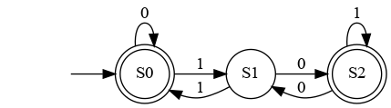

# Regex2NFA
Transform regular expression to Non-deterministic Finite Automata (NFA)

## How to run
1. download [graphviz](https://www.graphviz.org/download/) to be able to see the NFA graph.
2. install requirements by running  
   `pip install -r requirements.txt`  

There are 2 modes of operations:
1. input a regex string (e.g. `(a|b)*`) after running `python main.py`, it will produce this image  
     
   and it will save the JSON file following the [file structure](#output-json-file-structure) of this regex to `output/NFA.json`
2. input a json file following the [file structure](#output-json-file-structure), running `python main.py output/example.json` will produce this image   
   

## supported expressions
the valid symbols are alphanumeric or the following special characters
1. `*`: Repetition (0 or more) of the preceding token (e.g. `A*`)
2. `|`: OR between two tokens (e.g. `A|B`)
3. `(` and `)` to group tokens

## Output JSON File Structure
```json
{
    "startingState": "stateA",
    "stateA": {
        "isTerminatingState": false,
        "stateA": "inputCharacter1",
        "stateB": "inputCharacter2"
    },
    "stateB": {
        "isTerminatingState": true,
        "stateA": "inputCharacter2"
    },
}
``` 